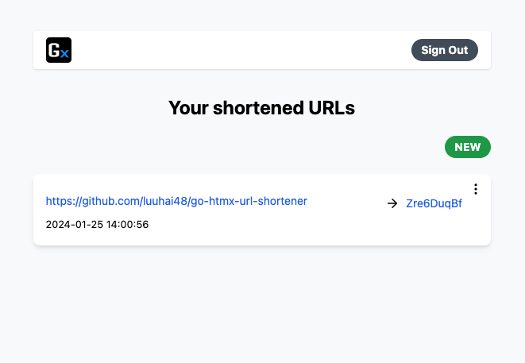

# URL Shortener - Written in Golang + HTMX

This is a simple URL shortener project written in Golang, combined with HTMX.
AlpineJS is there for convenient interaction.
Sqlite is used to store all the stuffs.

## Description

The project is just a demonstration and learn on how to create a website using very simple tech stack.

## Features

- Sign up, Sign in
- Shorten long URLs
- Redirect to original long URLs using the shortened version

## Installation and Usage

Make sure you have:

1. Golang version >= 1.21
2. [tailwindcss cli](https://tailwindcss.com/blog/standalone-cli)
3. [modd cli](https://github.com/cortesi/modd)
4. [templ cli](https://templ.guide/)

To install and use this project, follow these steps:

1. Clone the repository.
2. Install the necessary dependencies `go mod download`.
3. Run the project `go run cmd/*.go` or `make`.
4. Visit `http://localhost:3333`
